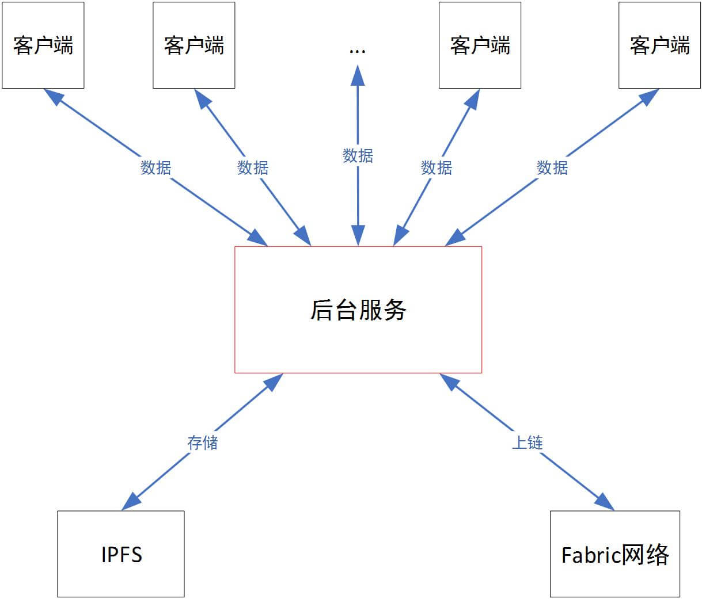

一个Fabric+IPFS数据上链的Demo

完整方案文档：[基于Fabric+IPFS大规模数据上链方案](https://www.wanghaoyi.com/fabric-ipfs-technical-solution.html)

  **Fabric简介、适用场景**：Hyperledger Fabric的出现是对传统区块链模型的一种革新，在某种程度上允许创建授权和非授权的区块链，Hyperledger还通过提供一个针对身份识别，可审计、隐私安全和健壮的模型，使得缩短计算周期、提高规模效率和响应各个行业的应用需求成为可能。
  **IPFS简介、适用场景**：分布式存储。
  **Fabric+IPFS优点、适用场景**：无需全部数据上链即可产生信任。
  本系统以后台服务开发为核心，作为链接客户端、IPFS及Fabric区块链的服务部件。当大量数据需要可靠实时地存储，并且在未来需要得到验证时，必须将数据以某种形式存入区块链。而传统区块链系统为了“安全”而牺牲“效率”，因此其数据存储的容量与速率非常低下，因此不能存放大规模数据。基于这种考虑，我们可以利用区块链+分布式存储的方式解决大规模数据上链的问题，将原始数据存于类似IPFS等分布式系统中，并将源文件的地址存储于区块链永久保存，用户可以通过区块链上文件的地址信息随时去获取这些数据。同时为了保证IPFS上数据不被篡改，必须将文件的指纹（Hash算法结果）也一并存入区块链，这样用户可以将得到的链上数据进行验证，以确定数据的完整性与可靠性。